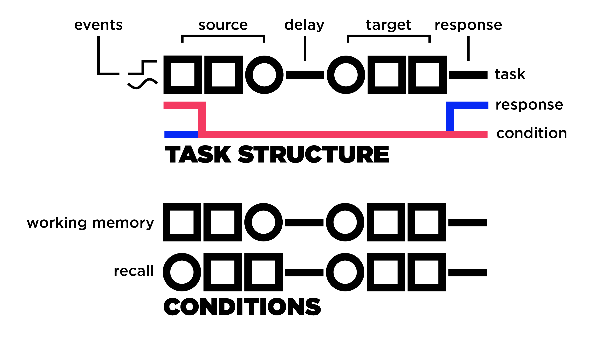

 

**TLDR**: It's a unified working &amp; short-term memory task for artificial neural networks.

## Motivation & such:
The idea of this task comes from the following paper:

[Foster, Nicholas E. V., Andrea R. Halpern, and Robert J. Zatorre. 2013. “**Common Parietal Activation in Musical Mental Transformations across Pitch and Time.**” NeuroImage 75: 27–35.
](https://www.sciencedirect.com/science/article/pii/S105381191300178X)

That I used in my M.Sc. thesis. After reading a couple of AI papers, I noticed people use the term "working memory" while they're referring to a "short term memory" task. The difference, as noted [here](https://www.frontiersin.org/articles/10.3389/fpsyg.2012.00301/full) & [here](https://www.sciencedirect.com/science/article/pii/S0079612307000209?via%3Dihub), is **manipulation of the stored information**. 
Put simply, if you're just holding something in your mind (like a phone number) for a short time, that's a short-term memory task. If you're required to perform some transformation then it's a working-memory task. There are many working-memory tasks each engaging different modalities like visual working memory or verbal working memory tasks. What Foster and colleagues did in the mentioned paper is in the family of _auditory working memory_ (and it's goddamn hard!).

## How-to:
The task is composed of two sets of events, source and target, separated by a period of silence. Then there's a second period of silence in the end dedicated for response. It is designed as a many-to-many scenario in which the network should produce an outcome at each timepoint but you can set the response time to 1 and reduce it to a many-to-one problem, which should be far easier. 
If the task condition is "recall" then the task is a short-term memory that means the network should decide if the target stimulus is the same as the source. This by itself, I found to be a non-trivial task, because the source should stay in memory during the silence period and then be compared with the target after the presentation of both stimuli. The longer the silence, the harder the task will become.
The actual "hard" task, however, is the working-memory condition in which a transformation is applied to the target so the network should perform the transformation during the silence and check if the same transformation is applied to the target. In other words, the target should be the same as the source given a transformation. For example, one transformation I implemented from Foster and colleagues is called "retrograde" that reverses the order of events in time. 
You can apply your own transformations, e.g., scaling events by a given factor.

 

By default, the output contains the task signal, a cue signal to indicate when to respond, a condition cue in case the network is trained simultaneously on both conditions, and the correct response. I implemented two event types one is a sinusoidal and the other is a step function but you can define your own function and hopefully it works! Turned out the sinusoidal events are much harder than the step ones because you need a longer signal in the end. If you decrease the event length to 1 and use a step function then you're basically feeding individual digits and I guess that should be the easiest setup.

## TODO:
Well, I need to write some tests! There probably are a few bugs so in case you found one before I do, please let me know.
